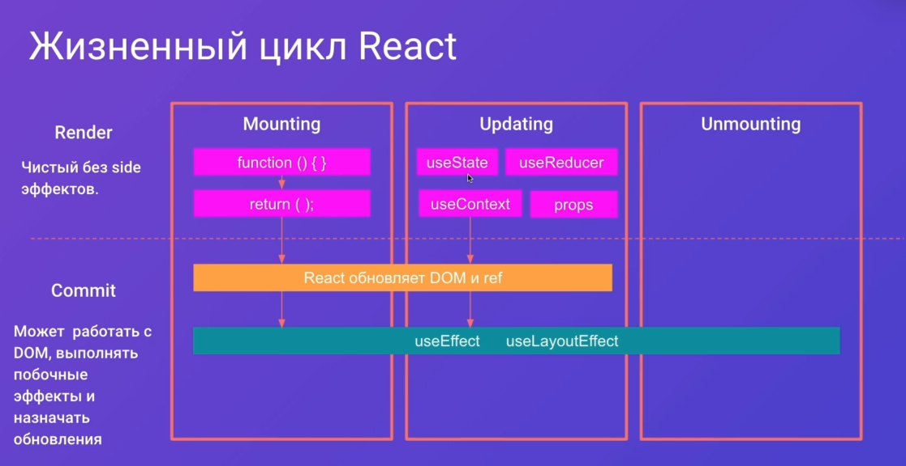

# Next.js

## Преимущества

- SSG, SSR и инкрементальная статическая генерация
- Оптимизация изображений
- Роутинг + интернализация
- Code-splitting
- Поддержка TS
- CSS modules and SASS
- Fast refresh for development


## Typescript

### Зачем нужны интерфейсы?

- Можно экстендить интерфейс
- Лучше всегда использовать интерфейс, типы только по необходимости когда есть разные типы `type stringOrNumber = string | number;`

```ts
type Point = {
	x:number,
	y:number
}
type D3Point = Point & {
	z: number;
}

interface IPoint {
	x:number,
	y:number
}

interface I3DPoint extends IPoint {
	z: number;
}

type stringOrNumber = string | number;

function print(coord: I3DPoint) {

}

```


### Commands
create next app

`npx create-next-app [project name] --use-npm`

add types to it

`npm i -D typescript @types/react @types/node`

additional eslint types
`npm i -D eslint @typescript-eslint/parser @typescript-eslint/eslint-plugin`

`npm i -D stylelint stylelint-config-standard stylelint-order stylelint-order-config-standard`


### React



### SVG for next.js 12
To embed the contents of an SVG file into your site using NextJS 12 with the new Rust-based compiler, perform the following steps:

1. Install `@svg/webpack`:

```sh
$ npm install --save-dev @svgr/webpack
```

2. Create a `svgr.config.js` config file with the following contents. This will remove the width and height from the SVG but keep the viewBox for correct scaling.

```js
module.exports = {
  dimensions: false,
};
```

4. Add to your webpack config in `next.config.js`
```js
module.exports = {
  webpack(config) {
    const fileLoaderRule = config.module.rules.find(
      (rule) => rule.test && rule.test.test('.svg'),
    );
    fileLoaderRule.exclude = /\.svg$/;
    config.module.rules.push({
      test: /\.svg$/,
      loader: require.resolve('@svgr/webpack'),
    });
    return config;
  },
};
```


4. Import SVG into component
```js
import Logo from 'public/images/logo.svg';
```

5. Use the Component
```js
<Logo className="h-8 w-auto sm:h-10" alt="Site Title" />
```
